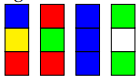

# Carpets
Cayden - Base methods to be used by the different match types
Tristan - Max Match
Rochelle - Balanced
Isaac - Not Match

## Implementation of MakeCarpets:
main(String[] args) method:
- Reads input carpets and their counts from standard input.
- Processes the arguments and initiates the carpet making process.
- process(HashMap<String, Integer> stock) method:
- Determines which type of carpet to make based on the mode specified.
- Calls the corresponding carpet-making method.

noMatches(HashMap<String, Integer> stock) method:
- Creates a carpet with no matching pieces vertically.
- Uses the highest stock carpet as the starting point.

maxMatches(HashMap<String, Integer> stock) method:
- Creates a carpet with as many matches as possible.
- Employs depth-first search to find the carpet with the most matches.

balanced(HashMap<String, Integer> stock) method:
- Creates a carpet as balanced as possible between matches and non-matches.
- Delegates the task to the Balanced class.

checkArgs(String[] args, int size) method:
- Checks and parses command-line arguments.
- Ensures correct usage of arguments.

findMaxCarpet(HashMap<String, Integer> stock, String output) method:
- Finds the carpet in the stock with the most matches with the current carpet.

noMatchCarpet(HashMap<String, Integer> stock, String prevCarp) method:
- Checks that the next carpet does not match vertically with the previous one.
- countMatches(String carpet, String carpet2, boolean max) method:
- Counts the number of matches between two carpets, considering both forward and reverse orientations.

## Implementation of Balance Support Class
Constructor:
- Initializes the stock, length, and carpetLength properties of the class.

task() method:
- Generates a carpet based on the stock with balanced matches and non-matches.
- Iterates through the length of the carpet, selecting the best next carpet to maintain balance.
- Calculates and appends the absolute difference between matches and non-matches at the end of the output.

findBestNext(String prevCarpet) method:
- Evaluates forward and reverse possible next carpets.
- Selects the carpet that leads to better balance between matches and non-matches.

forwardCheck(String prevCarp) and reverseCheck(String prevCarp) methods:
- Evaluate the balance of potential next carpets, considering forward and reverse orientations.
- Return the carpet that leads to better balance.

takeStock(String carpet) method:
- Decrements the count of a specific carpet from the stock.
- Removes the carpet from the stock if its count reaches zero.

largestStock() method:
- Finds and returns the carpet with the highest stock count.

## Carpets Narrative
Your great aunt Maude has, over the years, acquired a large collection of strips of carpet
squares. She wants to start a business of sewing them together into larger carpets for
sale. Of course people’s tastes differ so the criteria that make a carpet desirable can also
change depending on the customer or type of carpet. You’ll be trying to satisfy customer demand as well as you possibly can from the stock of material available.
In any given scenario, you will have a supply of some number of strips of differently
coloured squares, all of the same length. For instance you might have:

You will make carpets by sewing these strips together along their long sides. The criteria you need to satisfy will vary. It might be strictly forbidden to have two squares of the
same colour sewn together. Or, it might be desirable to have as many such coincidences
as possible or the best possible balance between coincidences and differences.
The trouble is that you don’t know in advance what a customer will ask for, so you
need to leave dear Maude with a working program into which she can enter:
- her current stock of carpet pieces,
- the carpet size requested, and
- the criteria for judging a carpet’s aesthetics.
The program will then tell her which items of stock to use and how to fit them together.
Detailed requirements are included in the task description below.
## Task
Write a program makeCarpet which takes as input from stdin a stock of carpet pieces
represented as lines of characters, each line of the same length. Use a command line
argument to give the size of carpet desired (a positive integer equal to the number of
pieces to be used) and a command line flag to represent the type. You must support the
following options:
**-n** No matches allowed (output, a suitable carpet, or “not possible”)
**-m** Maximum possible number of matches (output, a proposed solution followed by
the number of matches on the next line)
**-b** Best balance between matches and non-matches (output, a proposed solution followed by the absolute value of the difference between the number of matches
and non-matches)
## Standards
For an achieved standard, the program must work correctly on valid input requiring
carpets of at most 10 pieces (the stock may be larger).
Merit criteria include well-structured and readable code, and the ability to handle carpets of a larger size (exact limits could depend on mode).
Excellence criteria include some significant extension to the functionality of the program, or an investigation of general properties of the problems.
## Objectives
1.1, 1.2, 2.1, 2.2, 2.7-2.10, 3.3-3.5, 3.7, 4.1-4.4
(Group)